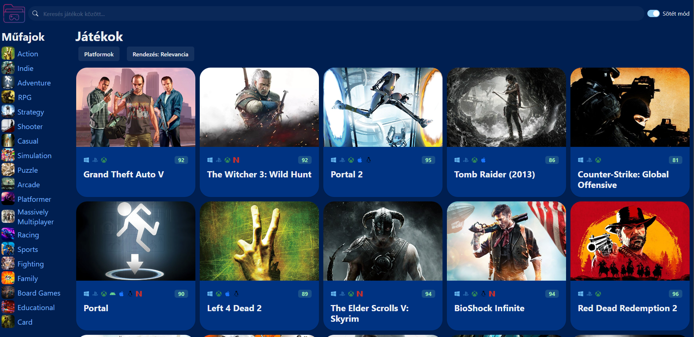
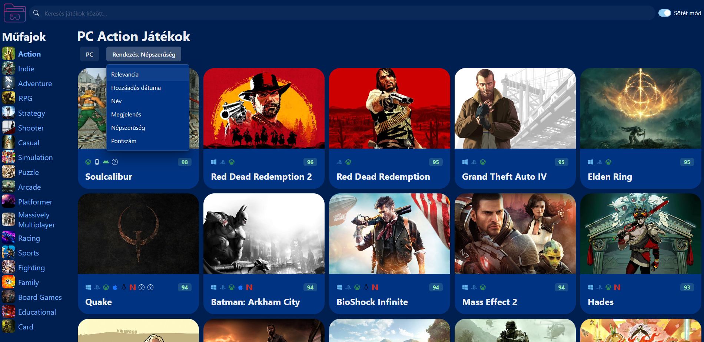
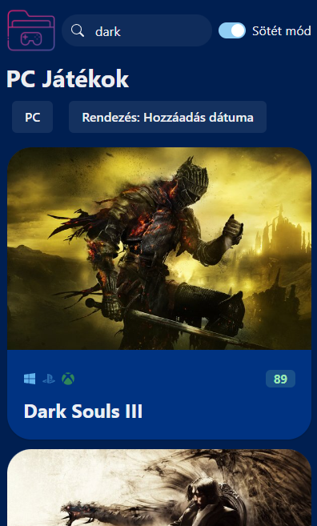
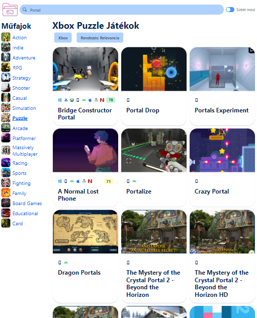

# Játék adatbázis böngésző webalkalmazás

Ez a webalkalmazás egy játék adatbázist böngésző alkalmazás, amely a RAWG.io API-ját használja. A projekt csak frontend részből áll, nincs hozzá backend, tehát az API hívások közvetlenül a kliens oldalon történnek. Az alkalmazás megjelenése a RAWG.io stílusát követi, és Mosh Hamedami React [kurzusa](https://codewithmosh.com/p/ultimate-react-part1) alpján készült. 

### Telepítés és használat:
1. Klónozd le ezt a repository-t a helyi gépedre.
2. Futtasd az npm install parancsot, hogy telepítsd a szükséges függőségeket.
3. Szerezz be egy RAWG API kulcsot a következő helyen: https://rawg.io/apidocs. Ingyenes fiók létrehozása után havonta 20e kérést küldhetsz a szervernek.
4. Add hozzá az API kulcsod az src/services/api-client.ts fájlhoz.
5. Az npm run dev-vel lehet futtatni.

### Képek:

|              |               |
| ------------ | ------------- |
| Alap főoldal  | Szűrők és rendezés  |
|              |               |
| Mobil nézet és keresés   | Világos mód kisebb képernyőn  |

### Használt technológiák:
- React
- ChakraUI
- Axios
- React icons

### A projekt írásakor figyelembe vettem:
- Seperation of concern-t (szétválasztás elve)
- Modularitást
- Újrafelhasználhatóságot
